# Residual-Point-svencoop

## This is a port of the Half-Life mod "Residual Point" for Sven Co-op.

### This project is abandoned and was once deleted as i didn't care a shit about it.

### But since i've found a copy of the repository on my local machine and it is fun to play in hardcore so i'll leave this here as the scmapdb's version is outdated asf and sucks ass.

### I ain't touching this unless i really want to fix something for kale's server. Though you are completely free to fork this repository, modify and do a pull request, i will be actively accepting.

[Reset achievements](https://github.com/Mikk155/svencoop-residualpoint/releases/tag/achievements);

[Download latest](https://github.com/Mikk155/svencoop-residualpoint/releases)

[Achievements info](#achievements-info)

[Map alternative paths](#map-alternative-paths)

# Map alternative paths

```mermaid
graph TD
    classDef CLobby fill:#f9f,stroke:#333,stroke-width:2,color:#fff;
    subgraph "Lobby"
        rp_c00_lobby:::CLobby
    end

    classDef CInbound fill:#80c1ff,stroke:#0366d6,stroke-width:2,color:#fff;
    subgraph "Black Mesa Inbound"
        rp_c00_lobby --> rp_c00_m1:::CInbound
        rp_c00_m1:::CInbound --> rp_c00_m2:::CInbound
        rp_c00_m2:::CInbound --> rp_c00_m3:::CInbound
        rp_c00_m3:::CInbound --> rp_c00_m4:::CInbound
        rp_c00_m4:::CInbound --> rp_c00_m5:::CInbound
    end

    classDef CSecurity fill:#80c1ff,stroke:#3c763d,stroke-width:2,color:#fff;
    subgraph "In Security"
        rp_c00_m5 --> rp_c01:::CSecurity
    end

    classDef CIncoming fill:#80c1ff,stroke:#3c763d,stroke-width:2,color:#fff;
    subgraph "Incoming"
        rp_c01 --> rp_c02:::CIncoming
    end

    classDef CAmongTheRuins fill:#80c1ff,stroke:#3c763d,stroke-width:2,color:#fff;
    subgraph "Among The Ruins"
        rp_c02 --> rp_c03_m1:::CAmongTheRuins
        rp_c03_m1:::CAmongTheRuins --> rp_c03_m2:::CAmongTheRuins
    end

    classDef COfficeFacility fill:#80c1ff,stroke:#3c763d,stroke-width:2,color:#fff;
    subgraph "Office Facility"
        rp_c03_m2 --> rp_c04:::COfficeFacility
    end

    classDef CObscureTrue fill:#80c1ff,stroke:#3c763d,stroke-width:2,color:#fff;
    subgraph "Obscure True"
        rp_c04 --> rp_c05:::CObscureTrue
    end

    classDef CResiduePit fill:#80c1ff,stroke:#3c763d,stroke-width:2,color:#fff;
    subgraph "Residue Pit"
        rp_c05 --> rp_c06:::CResiduePit
        rp_c06:::CResiduePit <--> rp_c06_pump:::CResiduePit
    end

    classDef CBombingSurface fill:#80c1ff,stroke:#3c763d,stroke-width:2,color:#fff;
    subgraph "Bombing Surface"
        rp_c06 --> rp_c07_m1:::CBombingSurface
        rp_c07_m1:::CBombingSurface --> rp_c07_m2sewer:::CBombingSurface
        rp_c07_m1:::CBombingSurface --> rp_c07_m2surface:::CBombingSurface
    end

    classDef CRecession fill:#80c1ff,stroke:#3c763d,stroke-width:2,color:#fff;
    subgraph "Recession"
        rp_c07_m2surface --> rp_c08_m1surface:::CRecession

        rp_c08_m1surface:::CRecession --> rp_c08_m2surface:::CRecession
        rp_c08_m1sewer:::CRecession --> #sewer:::CRecession
        #sewer:::CRecession --> rp_c08_m1surface:::CRecession
        rp_c07_m2sewer --> rp_c08_m1sewer:::CRecession
        rp_c08_m1surface:::CRecession --> #sewer2:::CRecession
        #sewer2:::CRecession --> rp_c08_m3surface:::CRecession

        rp_c08_m2surface:::CRecession --> rp_c08_m3surface:::CRecession
        rp_c08_m1sewer:::CRecession --> rp_c08_m2sewer:::CRecession
        rp_c08_m2sewer:::CRecession --> rp_c08_m3:::CRecession
        rp_c08_m3surface:::CRecession --> rp_c08_m4:::CRecession
        rp_c08_m3:::CRecession --> rp_c08_m4:::CRecession
    end

    classDef CDistortion fill:#80c1ff,stroke:#3c763d,stroke-width:2,color:#fff;
    subgraph "Distortion"
        rp_c08_m4 --> rp_c09:::CDistortion
        rp_c09:::CDistortion --> rp_c09_m1:::CDistortion
        rp_c09_m1:::CDistortion --> rp_c09_m2:::CDistortion
        rp_c09_m2:::CDistortion --> rp_c09_m3:::CDistortion
    end

    classDef CUpperYard fill:#80c1ff,stroke:#3c763d,stroke-width:2,color:#fff;
    subgraph "Upper Yard"
        rp_c09_m3 --> rp_c10_m1:::CUpperYard
        rp_c10_m1:::CUpperYard --> rp_c10_m2:::CUpperYard
        rp_c10_m2:::CUpperYard --> rp_c10_m3:::CUpperYard
    end

    classDef CCurseToLambda fill:#80c1ff,stroke:#3c763d,stroke-width:2,color:#fff;
    subgraph "Course to Lambda"
        rp_c10_m3 --> rp_c11:::CCurseToLambda
    end

    classDef CIntoThePortal fill:#80c1ff,stroke:#3c763d,stroke-width:2,color:#fff;
    subgraph "Into the portal"
        rp_c11 --> rp_c12_m1:::CIntoThePortal
        rp_c12_m1:::CIntoThePortal --> rp_c12_m2:::CIntoThePortal
        rp_c12_m2:::CIntoThePortal --> rp_c12_m3:::CIntoThePortal
    end

    classDef CDreadPlot fill:#80c1ff,stroke:#3c763d,stroke-width:2,color:#fff;
    subgraph "Dread Plot"
        rp_c12_m3 --> rp_c13_m1a:::CDreadPlot
        rp_c13_m1a:::CDreadPlot --> rp_c13_m2bc:::CDreadPlot
        rp_c13_m1a:::CDreadPlot --> rp_c13_m2a:::CDreadPlot
        rp_c13_m2a:::CDreadPlot --> rp_c13_m3a:::CDreadPlot
        rp_c13_m2bc:::CDreadPlot --> rp_c13_m3b:::CDreadPlot
        rp_c13_m3a:::CDreadPlot --> rp_c13_m4:::CDreadPlot
        rp_c13_m3b:::CDreadPlot --> rp_c13_m4:::CDreadPlot
        rp_c13_m4:::CDreadPlot --> rp_c00_lobby:::CLobby
    end

    classDef CTheLostMap fill:#80c1ff,stroke:#3c763d,stroke-width:2,color:#fff;
    subgraph "The lost map"
        rp_c13_m4 --> rp_c14:::CTheLostMap
        rp_c14:::CTheLostMap --> rp_c00_lobby:::CLobby
    end
```

# Achievements info

List of tasks to complete in order to receive unlockables at Residual point lobby.

Mostly made for me so i don't really forgot how the system works. but you're free to get spoiler instead of find them by yourself. since i even didn't a system for tell people about them until they're seen on the lobby x[

**ACHIEVEMETS**
map name | achievement | description | custom key
-------- | ----------- | ----------- | ---------
rp_c00 | secret hunter | pick up 1 secret item | $s_secrethunter_01
rp_c01 | secret hunter | pick up 1 secret item | $s_secrethunter_02
rp_c02 | secret hunter | pick up 1 secret item | $s_secrethunter_03
rp_c03_m1 | secret hunter | pick up 1 secret item | $s_secrethunter_04
rp_c03_m1 | secret hunter | pick up 1 secret item | $s_secrethunter_05
rp_c03_m1 | bodyguard | protect 1 otis npc | $s_bodyguard_03
rp_c03_m2 | secret hunter | pick up 1 secret item | $s_secrethunter_06
rp_c04 | bodyguard |protect 2 scientist and 1 otis npc | $s_bodyguard_02
rp_c05 | bodyguard | -REMOVED- still present in map but not available. | $s_bodyguard_01
rp_c05 | fisherman | kill 5 ichktyosaurs | $s_fishdiver01
rp_c07_m1 | bodyguard | protect 2 scientist, 1 barney npc | $s_bodyguard_04
rp_c07_m2sewer | explorer | reach the map | $s_explorer01
rp_c07_m2surface | explorer | reach the map | $s_explorer02
rp_c08_m1sewer | bodyguard | protect 1 cleansuit scientist | $s_bodyguard_05
rp_c08_m2surface | bodyguard | protect 2 scientist | $s_bodyguard_07
rp_c08_m1surface | bodyguard | protect 1 cleansuit scientist | $s_bodyguard_06
rp_c08_m2sewer | fisherman | kill 6 ichktyosaurs | $s_fishdiver02
rp_c08_m3 | fisherman | kill 18 ichktyosaurs | $s_fishdiver03
rp_c08_m3surface | explorer | reach the map FROM sewer | $s_explorer03
rp_c08_m3surface | bodyguard | protect 1 scientist or cleansuit | $s_bodyguard_08
rp_c08_m4 | bodyguard | protect 1 barney npc | $s_bodyguard_09
rp_c09_m1 | bodyguard | protect 1 barney npc | $s_bodyguard_10
rp_c10_m1 | bodyguard | protect 1 barney, 1 scientist npc | $s_bodyguard_11
rp_c11 | bodyguard | protect 1 barney npc | $s_bodyguard_12
rp_c12_m1 | bodyguard | protect 1 scientist npc | $s_bodyguard_13
rp_c13_m2a | explorer | reach the map | $s_explorer04
rp_c13_m2b | explorer | reach the map | $s_explorer05
rp_c13_m4 | unlock hardcore | reach the map | $s_hardcore
rp_c13_m4 | Limitless Potential | beat the campaign on the hardcore difficulty | $s_hardcore2
rp_c14 | explorer | finish the map | $s_explorer06
rp_c14 | teleporter | find a secret item | $s_displacer
rp_c14 | bodyguard | protect 1 otis npc | $s_bodyguard_14

**NOTE:** some achievements will be permanently saved while others such as "Body guard" will not. since they change when a npc die. i.e "secret hunter" will change to true once someone pick ups the item. then it'll be always on. but "body guard" IS always ON but when a npc specified die it'll change to false.
